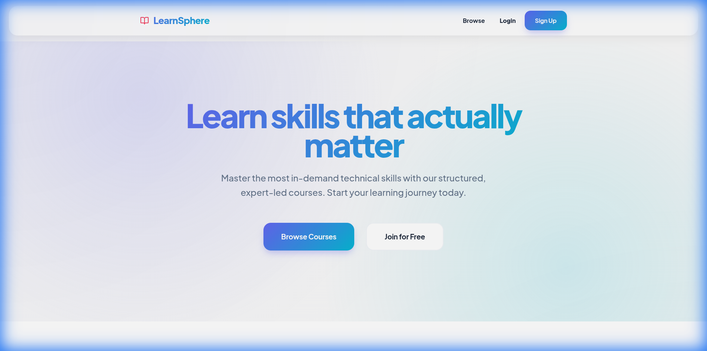
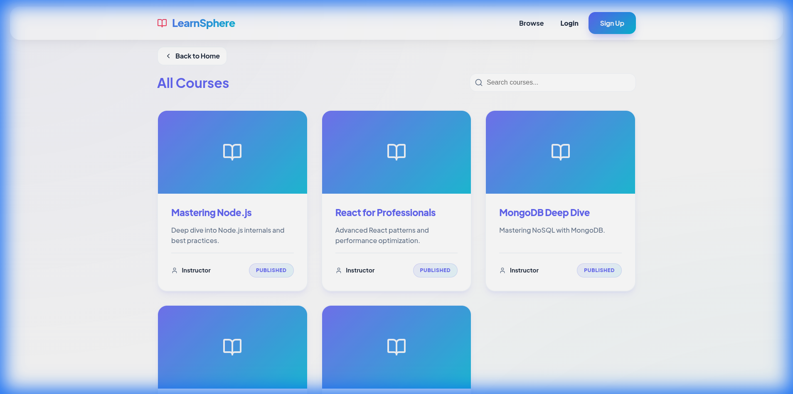
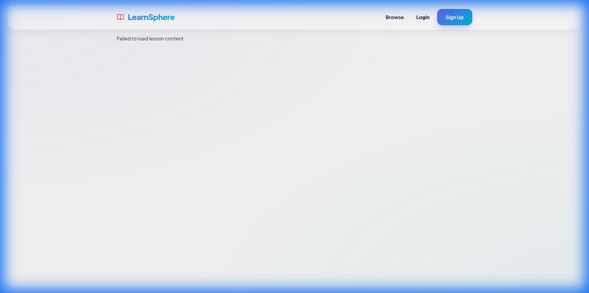
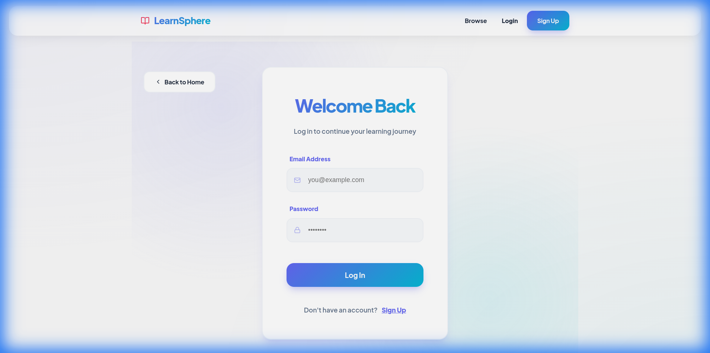

# LearnSphere 🚀

[](https://reactjs.org/)
[](https://nodejs.org/)
[](https://expressjs.com/)
[](https://www.mongodb.com/)
[](https://vitejs.dev/)

LearnSphere is a high-energy, full-stack Learning Management System (LMS) designed for a premium and immersive learning experience. Built with a robust **Node.js/Express** backend and a vibrant **React** frontend, it features a modern **"Vibrant & Modern"** UI overhaul that moves away from minimalism towards a high-impact, energetic aesthetic.


## ✨ Key Features

- **🎨 Vibrant & Modern UI**: A high-energy design system featuring mesh gradients, glowing accents, and bold typography (**Plus Jakarta Sans**).
- **🔐 Role-Based Access Control (RBAC)**: Distinct permissions for Students, Instructors, and Admins.
- **📚 Course & Lesson Management**: Full CRUD for courses and lessons with support for **Free Previews**.
- **⚡ Smart Enrollment System**: Dynamic enrollment/unenrollment with real-time status updates.
- **🎬 Immersive Lesson Player**: A high-contrast, dark-themed learning environment for focused study.
- **📊 My Learning Dashboard**: Personalized area for students to track their enrolled courses.
- **🛡️ Secure Authentication**: JWT-based auth with secure cookie handling and session persistence.

## 📸 Visual Showcase

### 🚀 High-Impact Landing Page



### 📚 Vibrant Course Catalog



### 🎬 Immersive Lesson Player



### 🔐 Secure & Modern Auth



## 🛠 Tech Stack

### Frontend

- **Framework**: React (Vite)
- **Styling**: Vanilla CSS (Custom Vibrant Design System)
- **Icons**: Lucide React
- **State Management**: React Context API
- **API Client**: Axios

### Backend

- **Runtime**: Node.js
- **Framework**: Express.js
- **Database**: MongoDB (Mongoose)
- **Security**: JWT, Bcrypt, Cookie-parser
- **Validation**: Validator.js

## 📂 Project Structure

```text
LearnSphere/
├── client/           # React Frontend
│   ├── src/
│   │   ├── components/  # Reusable UI components
│   │   ├── pages/       # Page-level components
│   │   ├── styles/      # Global & component styles
│   │   └── services/    # API service layer
├── server/           # Node.js Backend
│   ├── src/
│   │   ├── modules/     # Feature-based modules (Auth, Course, Lesson, etc.)
│   │   ├── middleware/  # Auth & Role-based guards
│   │   └── utils/       # Shared utilities
```

## ⚙️ Getting Started

### Prerequisites

- Node.js (v18+)
- MongoDB (Local or Atlas)

### 1. Backend Setup

```bash
cd server
npm install
```

Create a `.env` file in the `server` directory:

```env
PORT=8888
MONGO_URI=your_mongodb_uri
JWT_SECRET=your_secret
REFRESH_TOKEN_SECRET=your_refresh_secret
NODE_ENV=development
```

Run the seed script to populate the database:

```bash
node seed.js
```

### 2. Frontend Setup

```bash
cd client
npm install
```

Create a `.env` file in the `client` directory:

```env
VITE_API_URL=http://localhost:8888
```

### 3. Run the Application

Start the backend:

```bash
cd server
npm run dev
```

Start the frontend:

```bash
cd client
npm run dev
```

The app will be available at `http://localhost:5173`.

## 🔐 Dummy Credentials

All dummy accounts use the password: **`Password123!`**

| Role           | Email                         |
| :------------- | :---------------------------- |
| **Admin**      | `admin@learnsphere.com`       |
| **Instructor** | `instructor1@learnsphere.com` |
| **Student**    | `student1@learnsphere.com`    |

## test-card details for payment

Card Number: 4242 4242 4242 4242

Card Expiry: 12/24

Card CVC: 123

---

## 📖 API Documentation

A Postman collection is included in the `server` directory: `postman_collection.json`.

---

## 🚀 Future Roadmap

- [ ] **Quiz System**: Interactive assessments at the end of each lesson.
- [ ] **Progress Tracking**: Visual progress bars and completion certificates.
- [ ] **Payment Integration**: Support for Stripe/PayPal for paid courses.
- [ ] **Mobile App**: Dedicated mobile experience using React Native.
- [ ] **Live Classes**: Integration with Zoom/Jitsi for real-time sessions.

## 📄 License

This project is licensed under the MIT License.

---

Built with ❤️ by the LearnSphere Team.
